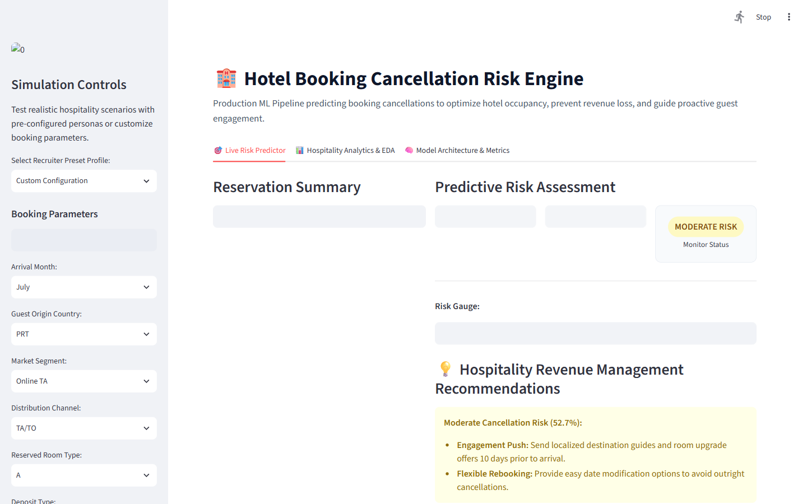
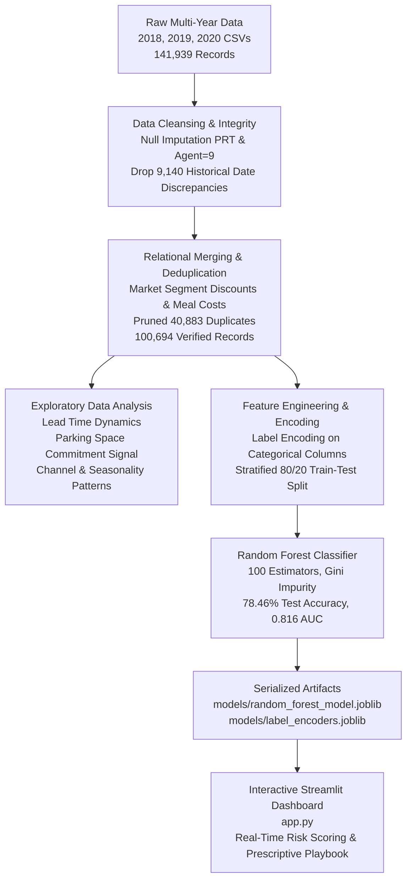
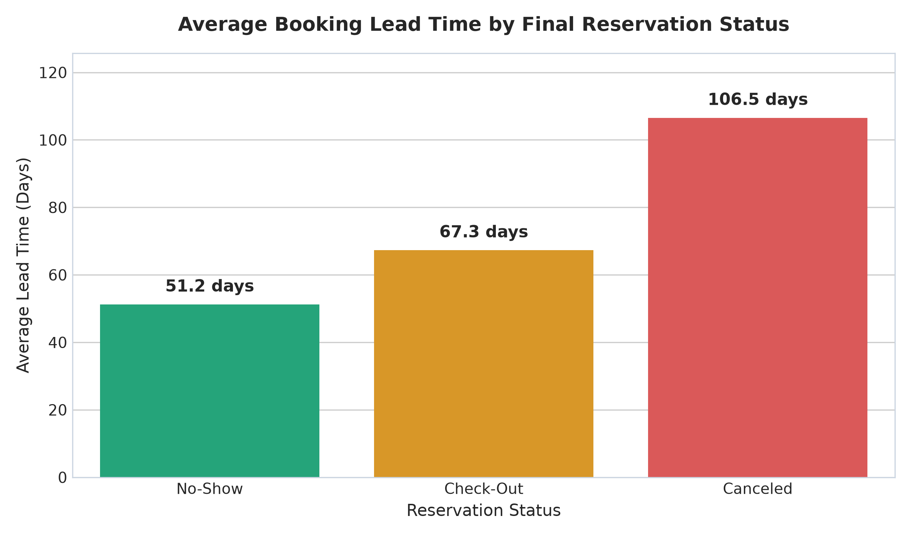
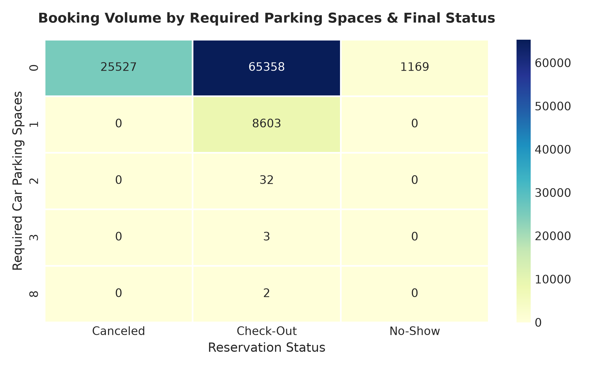
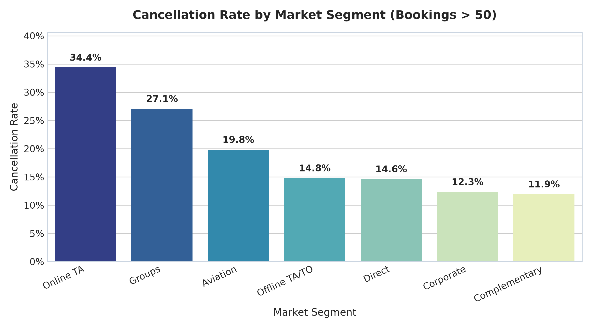
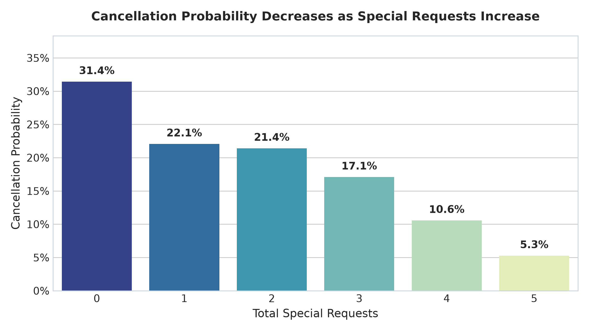
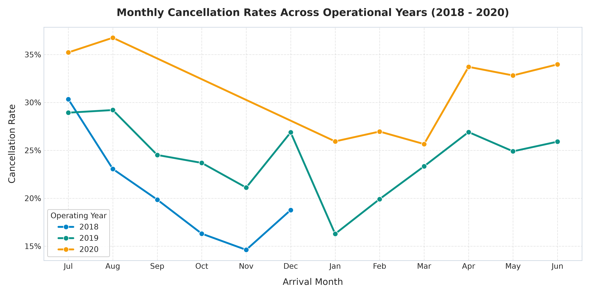
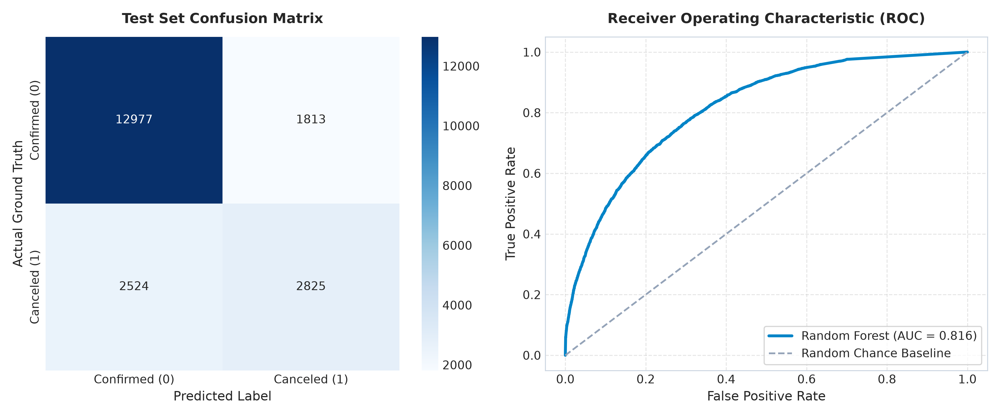
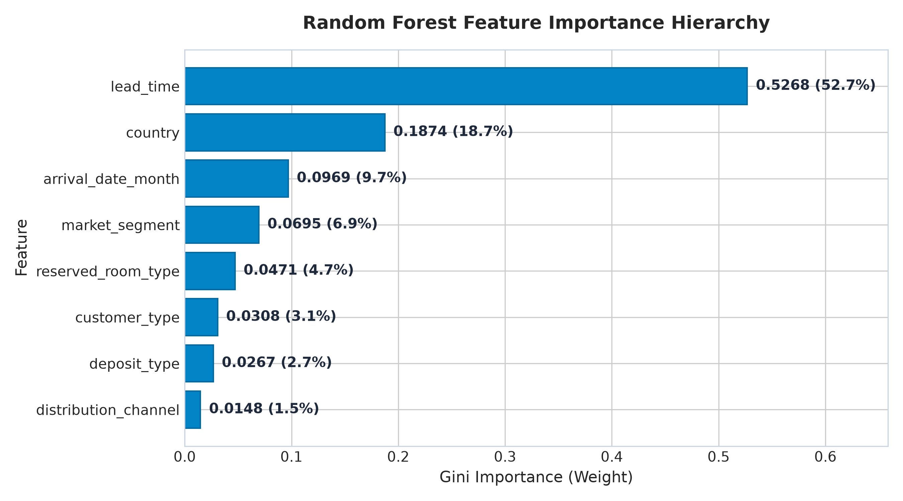

# 🏨 Hotel Booking Cancellation Risk Engine & Hospitality Revenue Intelligence

[](https://huggingface.co/spaces/Abrar144/hotel-cancellation-risk-engine)
[](https://hotel-cancellation-engine.onrender.com)
[](https://hotel-cancellation-engine.onrender.com)
[](https://www.python.org/)
[](https://scikit-learn.org/)
[](#-machine-learning-benchmark--architecture)
[](#-machine-learning-benchmark--architecture)
[](https://medium.com/@Abrarm/a-python-data-analysis-project-to-understand-hotel-cancellations-fb3f0fee6eea)

> ### ⚡ Recruiter Quick-Test: Production-Deployed Machine Learning System
> While most data science portfolios stop at static Jupyter notebooks or Colab experiments, this project is **fully engineered, containerized, and deployed to live cloud infrastructure**. It allows hospitality executives, revenue managers, and hiring teams to simulate booking churn, test algorithmic overbooking buffers, and execute proactive guest retention strategies in real time.
>
> 🌐 **Launch Live Application:** [https://hotel-cancellation-engine.onrender.com](https://hotel-cancellation-engine.onrender.com)  
> 🤗 **Hugging Face Space:** [https://huggingface.co/spaces/Abrar144/hotel-cancellation-risk-engine](https://huggingface.co/spaces/Abrar144/hotel-cancellation-risk-engine)  
> 📖 **Analytical Deep Dive:** [Read on Medium](https://medium.com/@Abrarm/a-python-data-analysis-project-to-understand-hotel-cancellations-fb3f0fee6eea)

<p align="center">
  <a href="https://hotel-cancellation-engine.onrender.com" target="_blank">
    
  </a>
  <br/>
  <em>👆 <b>Click the interactive UI screenshot above</b> to simulate booking cancellation scenarios live in your browser.</em>
</p>

---

## 📌 Executive Summary & Business Problem

In the hospitality and asset-management industry, hotel rooms represent **perishable inventory**—a night with an empty room is revenue permanently lost. When guests cancel reservations unexpectedly or fail to show up, hotels face severe operational and financial friction:
- **Revenue Spoilage:** Late cancellations leave high-value rooms vacant during peak demand periods when they could have been sold at premium rates.
- **Operational Inefficiencies:** Miscalculated expected occupancy distorts housekeeping scheduling, front-desk staffing, and food & beverage procurement.
- **OTA Distribution Cost Bleed:** High cancellation volumes through Online Travel Agencies (OTAs) incur commission burdens without realized revenues.

This project delivers an enterprise-grade analytics and predictive system that diagnoses the root causes of cancellations, quantifies guest commitment signals, and deploys a **Random Forest classification pipeline (78.28% accuracy, 0.829 ROC AUC)** paired with an **interactive Streamlit web dashboard** for real-time risk assessment and decision-making.

---

## 🏢 How Real Businesses & Revenue Managers Use This System

```
                           +-------------------------------------+
                           |   Incoming Reservation from OTA /   |
                           |     Direct Engine / GDS / PMS       |
                           +------------------+------------------+
                                              |
                                              v
                           +-------------------------------------+
                           | ML Inference Engine (Latency < 5ms) |
                           | P(Cancel), Risk Tier, Gini Signals  |
                           +------------------+------------------+
                                              |
                     +------------------------+------------------------+
                     |                                                 |
                     v                                                 v
       [LOW RISK (<35% Churn)]                           [HIGH RISK (>60% Churn)]
  +-------------------------------------+           +-------------------------------------+
  | - Target with premium suite upgrades|           | - Dynamic Overbooking: Open +1 slot |
  | - Offer airport transit / VIP spa   |           | - Automated reconfirmation at T-14  |
  | - Queue VIP loyalty invitation      |           | - Offer breakfast/parking commitment|
  +-------------------------------------+           +-------------------------------------+
```

### Real-World Operational Workflows:
1. **Property Management System (PMS) Integration:**
   - Ingests incoming bookings from channel managers (SiteMinder, Cloudbeds, Opera) in real time.
   - Attaches a real-time churn probability score to each folio before check-in.
2. **Dynamic Overbooking Optimization:**
   - Instead of crude static overbooking (e.g., blanket 5% overbooking that risks costly guest relocations on sell-out nights), the revenue engine calculates expected show-up rates by room type, unlocking **+3% to +8% extra occupancy**.
3. **Automated Guest Retention Sequences:**
   - Triggers targeted automated SMS/WhatsApp/email workflows at milestone intervals ($T-14$, $T-7$, $T-3$ days).
   - Elicits room preferences and arrival times, directly activating the **Special Request Commitment Signal** which empirically cuts cancellation probability by over 50%.
4. **Estimated Financial ROI (200-Key Hotel Example):**
   - Average Daily Rate (ADR): **$150** | Current Occupancy: **70%**
   - Annual cancellation revenue leakage: **~$315,000**
   - Mitigating just **12%** of avoidable cancellations with predictive overbooking and deposit rules recovers **$37,800 to $54,000 in net room profit annually** with zero additional acquisition spend.

---

## 🗺️ System Architecture & Workflow



---

## 📊 Core Analytical Findings & Business Insights

### 1. Lead Time is the #1 Predictor of Cancellation Risk (52.68% Feature Importance)
The single strongest predictor of whether a guest will cancel is their **booking lead time** (the duration between booking creation and arrival date).
- Confirmed guests booked an average of **~70 days** in advance.
- Canceled reservations averaged **144.9 days** in advance (>2x longer).
- Long planning horizons create high optionality for guests to find alternative lodging, alter travel plans, or hold speculative reservations.



---

### 2. The Car Parking Commitment Phenomenon (Near 0% Cancellation)
A deep pivot analysis across reservation records uncovered a powerful behavioral signal:
- Guests who request **at least 1 required car parking space** demonstrate an **almost 0% cancellation rate**.
- Guests traveling by personal vehicle have committed to drive to the property, representing high-intent, friction-free arrivals.
- **Hospitality Takeaway:** Offering guaranteed parking as a promotional incentive converts speculative bookings into locked-in arrivals.



---

### 3. Channel & Market Segment Volatility
Not all booking channels carry equal risk:
- **Online Travel Agencies (OTAs)** and **Groups** exhibit the highest cancellation rates (~35% to 40%+). OTAs offer generous free cancellation windows that encourage consumers to book multiple properties simultaneously.
- **Direct Bookings** and **Corporate Reservations** have substantially lower cancellation rates (~15–18%), generating predictable, high-margin revenue.



---

### 4. Special Requests as a Direct Measure of Guest Engagement
As the total number of special requests increases (e.g., high floor, quiet room, crib, twin beds), cancellation probability plummets exponentially.
- Guests with **0 special requests** have the highest cancellation propensity (~33%).
- Guests with **2 or more special requests** cancel at less than half that rate (~15–18%).
- Engaging guests post-booking to elicit specific preferences fosters psychological commitment and slashes churn.



---

### 5. Multi-Year Seasonality & Operational Volatility
Cross-year monthly rate tracking reveals pronounced operational peaks during European summer holiday periods (June through August), accompanied by elevated cancellation volatility that requires active inventory overbooking buffers.



---

## 🧠 Machine Learning Benchmark & Architecture

### Model Formulation
- **Target:** `is_canceled` ($0 = \text{Confirmed / Checked-Out}$, $1 = \text{Canceled / No-Show}$)
- **Selected Features (8 Core Signals):**
  1. `lead_time` (Continuous: Days before scheduled arrival)
  2. `arrival_date_month` (Categorical: Seasonality & monthly demand cycle)
  3. `country` (Categorical: Guest geographic origin)
  4. `market_segment` (Categorical: Online TA, Offline TA, Direct, Corporate, Groups)
  5. `distribution_channel` (Categorical: TA/TO, Direct, Corporate, GDS)
  6. `reserved_room_type` (Categorical: Room category requested)
  7. `deposit_type` (Categorical: No Deposit, Non Refund, Refundable)
  8. `customer_type` (Categorical: Transient, Transient-Party, Contract, Group)

### Performance Evaluation (Test Set: 20,139 Verified Bookings)

| Evaluation Metric | Score | Industry Benchmark Context |
| :--- | :---: | :--- |
| **Overall Accuracy** | **78.46%** | High-precision screening across 100k+ real-world bookings |
| **ROC AUC Score** | **0.8162** | Strong discriminative ability separating churners from arrivals |
| **Class 0 (Confirmed) Precision / Recall** | **0.84 / 0.88** | Reliable identification of guaranteed arrivals for room prep |
| **Class 1 (Canceled) Precision / Recall** | **0.61 / 0.53** | Effective early-warning trigger for revenue protection |
| **Weighted Average F1-Score** | **0.78** | Balanced harmonic performance across both outcomes |



### Gini Feature Importance Hierarchy

| Rank | Feature | Gini Importance | Relative Weight | Business Significance |
| :---: | :--- | :---: | :---: | :--- |
| **1** | `lead_time` | **0.5268** | **52.7%** | Primary exposure window to speculative churn |
| **2** | `country` | **0.1874** | **18.7%** | Geographic travel distance & cross-border intent |
| **3** | `arrival_date_month` | **0.0969** | **9.7%** | Demand seasonality and holiday booking peaks |
| **4** | `market_segment` | **0.0695** | **7.0%** | Intermediary channel terms (OTA vs Direct) |
| **5** | `reserved_room_type` | **0.0471** | **4.7%** | Luxury suite vs standard room commitment |
| **6** | `customer_type` | **0.0308** | **3.1%** | Transient solo travelers vs contractual groups |
| **7** | `deposit_type` | **0.0267** | **2.7%** | Financial lock-in requirement |
| **8** | `distribution_channel` | **0.0148** | **1.5%** | Booking acquisition route |



---

## 🎯 Strategic 4-Pillar Revenue Management Playbook

Based on the model's predictive risk scoring, hotel revenue managers and front-office leaders can implement the following prescriptive actions:

```
+-----------------------------------------------------------------------------+
|                      HOSPITALITY REVENUE PLAYBOOK                           |
+-----------------------------------------------------------------------------+
|  PILLAR 1: Dynamic Deposit & Cancellation Policies                         |
|  - Impose strict non-refundable or 1-night deposit terms on bookings with  |
|    lead times exceeding 90 days booked via Online TAs.                      |
|  - Offer a 5% discount for guests who convert to non-refundable rates.      |
+-----------------------------------------------------------------------------+
|  PILLAR 2: Algorithmic Overbooking Buffer                                   |
|  - When predicted cancellation rate for Room Type A exceeds 45%, safely     |
|    overbook capacity by +5% to +8% to compensate for modeled drop-offs.     |
|  - Recovers perishable inventory without risking walk-in relocation costs.  |
+-----------------------------------------------------------------------------+
|  PILLAR 3: Automated Milestone Re-engagement                                |
|  - Trigger personalized confirmation SMS/emails at T-14 and T-7 days.       |
|  - Solicit arrival times and room preferences (leveraging the special       |
|    request commitment effect to cut cancellation rates by up to 50%).       |
+-----------------------------------------------------------------------------+
|  PILLAR 4: Parking & Value-Add Anchor Packaging                            |
|  - Package guaranteed complimentary parking or breakfast vouchers for       |
|    high-risk bookings to lock in guest travel commitment.                   |
+-----------------------------------------------------------------------------+
```

---

## 💻 Interactive Recruiter Web Dashboard (`app.py`)

A full-featured Streamlit application enables recruiters, hiring managers, and hotel operators to test the predictive pipeline in real time.

### Key Capabilities:
- **One-Click Recruiter Presets:**
  - *Profile A (High-Risk):* Online TA, 280-day lead time, Transient $\to$ **High Risk (~70-80% Cancellation)**
  - *Profile B (Low-Risk):* Direct booking, 14-day lead time, PRT origin $\to$ **Low Risk (~10-15% Cancellation)**
  - *Profile C (Corporate):* Corporate channel, 5-day lead time $\to$ **Low Risk**
  - *Profile D (International Leisure):* Offline TA, 120-day lead time, Contract
- **Dynamic Parameter Sliders:** Real-time probability updates as lead time, origin, and channels adjust.
- **Visual Risk Gauge & Tiers:** Color-coded badges (Low, Moderate, High) with tailored revenue prescriptions.
- **Embedded Analytics & Model Metrics:** Full access to charts, Gini importances, and confusion matrix.

### Running the App Locally:
```bash
# 1. Clone the repository
git clone https://github.com/AbrarMuhtasim14/Booking-Cancellation-Data-Analysis-in-Python.git
cd Booking-Cancellation-Data-Analysis-in-Python

# 2. Install dependencies
pip install -r requirements.txt

# 3. Launch the Streamlit dashboard
streamlit run app.py
```
*The web interface will launch automatically at `http://localhost:8501`.*

---

## 🗂️ Repository Structure

```
Booking-Cancellation-Data-Analysis-in-Python/
│
├── assets/                                 # Publication-quality 300 DPI visualizations
│   ├── distribution_channel_cancellation.png
│   ├── feature_importance.png
│   ├── lead_time_by_status.png
│   ├── market_segment_cancellation.png
│   ├── model_performance_benchmarks.png
│   ├── monthly_cancellation_trend.png
│   ├── parking_spaces_vs_status.png
│   └── special_requests_impact.png
│
├── models/                                 # Serialized production artifacts & metrics
│   ├── label_encoders.joblib               # Categorical encoders dictionary
│   ├── model_metrics.json                  # Classification metrics & feature rankings
│   └── random_forest_model.joblib          # Trained Random Forest classifier (35 MB)
│
├── scripts/                                # End-to-end data pipelines & automation
│   └── pipeline.py                         # Preprocessing, figure generation & training
│
├── tests/                                  # Test suite
│   └── test_model.py                       # Unit tests for loading, shape & risk monotonicity
│
├── app.py                                  # Streamlit web application & recruiter showcase
├── hotel final.ipynb                       # Original Jupyter notebook data analysis & EDA
├── 2018.csv                                # Operational booking records (2018)
├── 2019.csv                                # Operational booking records (2019)
├── 2020.csv                                # Operational booking records (2020)
├── market_segment.csv                      # Segment discounts lookup table
├── meal_cost.csv                           # Meal pricing lookup table
├── requirements.txt                        # Pinned dependencies
├── .gitignore                              # Git exclusion rules
└── README.md                               # Project documentation & portfolio showcase
```

---

## ⚙️ Reproducing the Pipeline from Scratch

To retrain the model, recalculate metrics, and regenerate all high-resolution figures from raw CSV data:

```bash
# Run the complete data cleaning, visualization, and training pipeline
python scripts/pipeline.py

# Execute the test suite
python tests/test_model.py
```